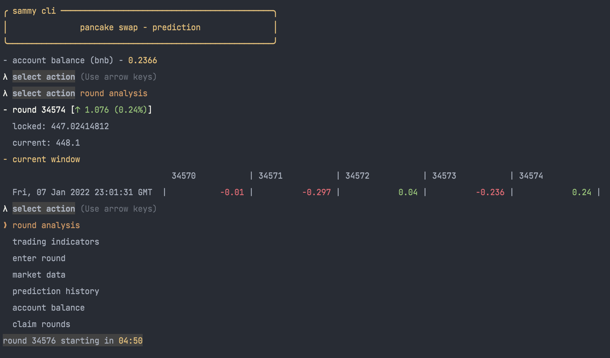
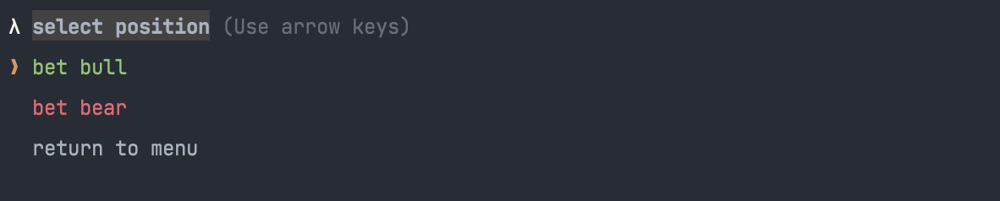
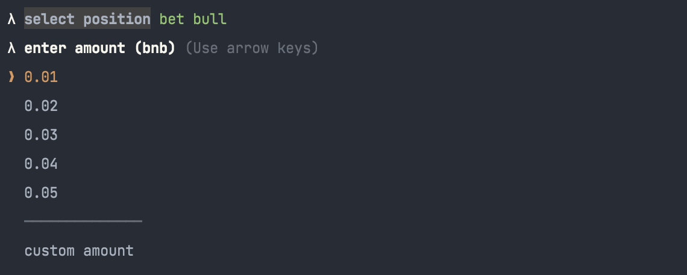
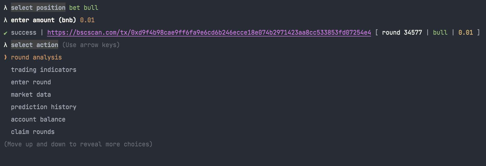
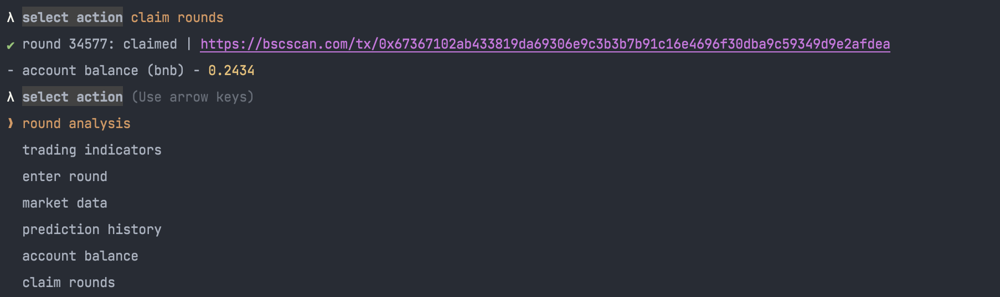
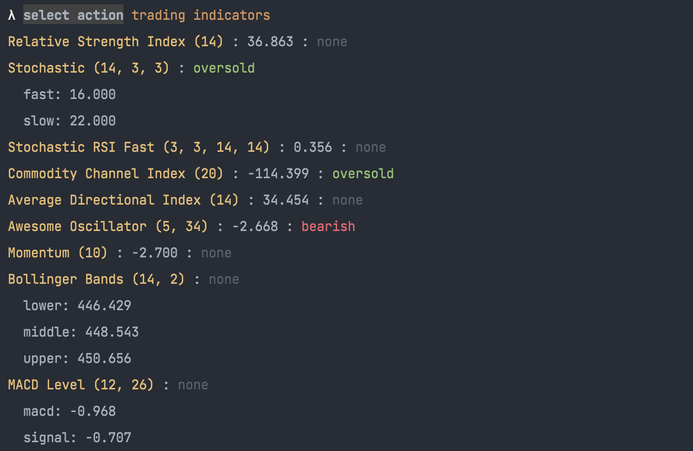
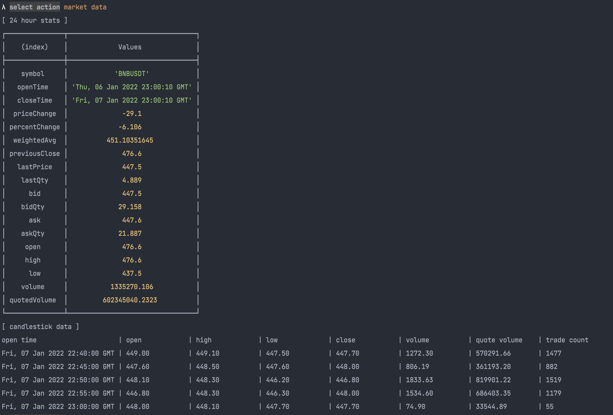
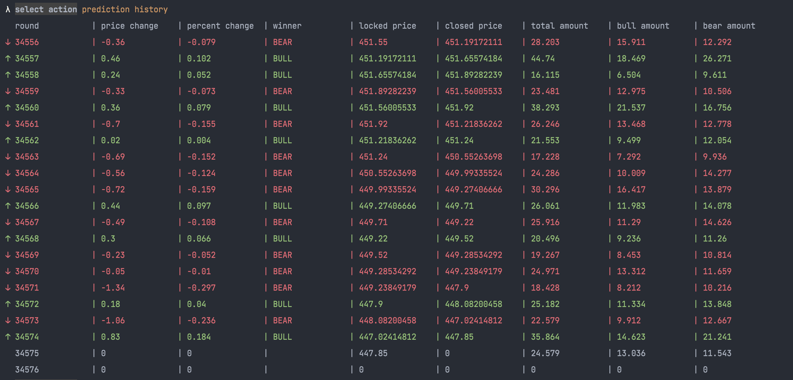

# Price Prediction Decentralized App - CLI

---

# Background

Decentralized applications (dApps) are programs that run on a blockchain or P2P network.
DApps use smart contracts to complete transactions between two anonymous parties without the need to rely on a central authority.
PancakeSwap, a popular dApp built on the Binance Smart Chain, is a decentralized exchange that allows for trading cryptocurrencies and tokens without an intermediary.
It is built on an automated market maker (AMM) system, offering financial services and products, such as swapping, trading, yield farming, staking, lotteries, and price predictions.

[PancakeSwap Prediction dApp](https://pancakeswap.finance/prediction)

One of the financial products offered by PancakeSwap is PancakeSwap Prediction, which is decentralized prediction market.

From the [documentation](https://docs.pancakeswap.finance/products/prediction):

> - Predict if the price of BNBUSDT will be higher or lower than it was when the “LIVE” phase starts.
> - If you enter an “UP” position, and the BNBUSDT “Closed Price” is higher than the “Locked Price” at the end of the 5 minute LIVE phase, you WIN! And if it’s lower, you lose.
> - If you enter a “DOWN” position, and the BNBUSDT “Closed Price” is higher than the “Locked Price” at the end of the 5 minute LIVE phase, you LOSE! If it’s lower, you win.

---

# Project Overview

The PancakeSwap user interface is a playful and colorful, and offers the basic functionality of interacting with the smart contract.
As I continued to use the dApp, I realized I wanted a quicker, more efficient way to interact with the smart contract along with other resources that I used to help make decisions when entering in new positions.
I created a PancakeSwap Prediction CLI to help as an ongoing personal project and utility, below are the key technologies and action screenshots of the project.

**Language:** NodeJS, Typescript

**Key Libraries:**
- ethereumjs, ethers, web3 (for contract interaction)
- typechain (for generating types from contract ABI)
- inquirer, chalk, boxen (for cli api)
- lodash, bn.js, dotenv, trading-signals, (misc)

--- 

# Action Screenshots

> Selecting *round analysis* presents the results of the last few rounds, along with the current round price.

>
> Selecting *enter round* prompts for a position, and amount

>
> Predefined amounts are listed for quick interactions. A custom amount option at the bottom if we want to get spicy.

> 
> A link to the bsc block explorer with our transaction hash means we successfully entered the round.

>
> Once the round is over, we can claim the round if our guess was correct.

>
> Selecting *trading indicators* presents a list of market indicators to help with analysis. Data is pulled from the Binance public API.

>
> Selecting *market data* presents 24 hour statistics and recent OHLC candles

>
> Selecting *prediction history* presents the results of the last 20 rounds to add to our context analysis.

---
